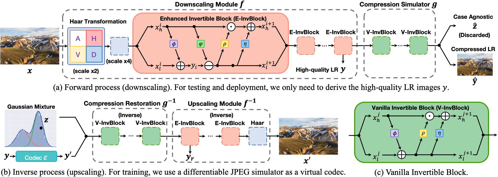
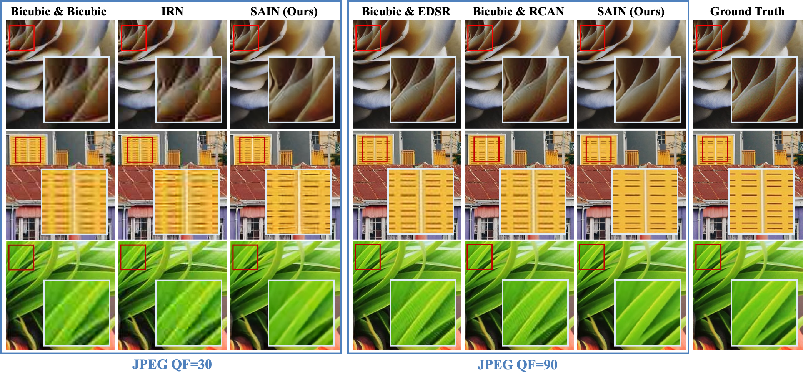
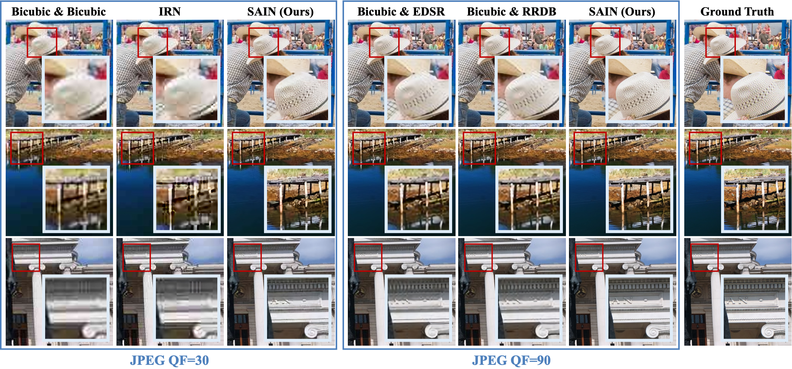
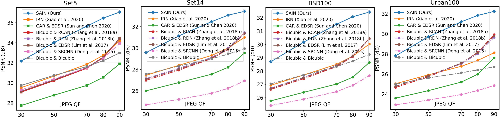

# Self-Asymmetric Invertible Network (SAIN)
This is the PyTorch implementation of paper "Self-Asymmetric Invertible Network for Compression-Aware Image Rescaling" (AAAI 2023 Oral). [[arxiv](https://arxiv.org/abs/2303.02353)]

## Abstract
High-resolution (HR) images are usually downscaled to low-resolution (LR) ones for better display and afterward upscaled back to the original size to recover details. Recent work in image rescaling formulates downscaling and upscaling as a unified task and learns a bijective mapping between HR and LR via invertible networks. However, in real-world applications (e.g., social media), most images are compressed for transmission. Lossy compression will lead to irreversible information loss on LR images, hence damaging the inverse upscaling procedure and degrading the reconstruction accuracy. In this paper, we propose the Self-Asymmetric Invertible Network (SAIN) for compression-aware image rescaling. To tackle the distribution shift, we first develop an end-to-end asymmetric framework with two separate bijective mappings for high-quality and compressed LR images, respectively. Then, based on empirical analysis of this framework, we model the distribution of the lost information (including downscaling and compression) using isotropic Gaussian mixtures and propose the Enhanced Invertible Block to derive high-quality/compressed LR images in one forward pass. Besides, we design a set of losses to regularize the learned LR images and enhance the invertibility. Extensive experiments demonstrate the consistent improvements of SAIN across various image rescaling datasets in terms of both quantitative and qualitative evaluation under standard image compression formats (i.e., JPEG and WebP).

## Framework Overview


## Qualitative Results
Qualitative results of image rescaling (×2) on DIV2K under distortion at different JPEG QFs.


Qualitative results of image rescaling (×4) on DIV2K under distortion at different JPEG QFs.


## Quantitative Results
Quantitative results (PSNR / SSIM) of image rescaling on DIV2K under distortion at different JPEG QFs.
| Downscaling & Upscaling | Scale      | JPEG QF=30                      | JPEG QF=50                      | JPEG QF=70                      | JPEG QF=80                      | JPEG QF=90                      |
|------------------------|------------|---------------------------------|---------------------------------|---------------------------------|---------------------------------|---------------------------------|
| Bicubic & Bicubic       | $\times2$  | 29.38 / 0.8081                  | 30.19 / 0.8339                  | 30.91 / 0.8560                  | 31.38 / 0.8703                  | 31.96 / 0.8878                  |
| Bicubic & SRCNN         | $\times 2$ | 28.01 / 0.7872                  | 28.69 / 0.8154                  | 29.43 / 0.8419                  | 30.01 / 0.8610                  | 30.88 / 0.8878                  |
| Bicubic & EDSR          | $\times 2$ | 28.92 / 0.7947                  | 29.93 / 0.8257                  | 31.01 / 0.8546                  | 31.91 / 0.8753                  | 33.44 / 0.9052                  |
| Bicubic & RDN           | $\times 2$ | 28.95 / 0.7954                  | 29.96 / 0.8265                  | 31.02 / 0.8549                  | 31.91 / 0.8752                  | 33.41 / 0.9046                  |
| Bicubic & RCAN          | $\times 2$ | 28.84 / 0.7932                  | 29.84 / 0.8245                  | 30.94 / 0.8538                  | 31.87 / 0.8749                  | 33.44 / 0.9052                  |
| CAR & EDSR              | $\times 2$ | 27.83 / 0.7602                  | 28.66 / 0.7903                  | 29.44 / 0.8165                  | 30.07 / 0.8347                  | 31.31 / 0.8648                  |
| IRN                    | $\times 2$ | 29.24 / 0.8051                  | 30.20 / 0.8342                  | 31.14 / 0.8604                  | 31.86 / 0.8783                  | 32.91 / 0.9023                  |
| SAIN (Ours)            | $\times 2$ | **31.47 / 0.8747** | **33.17 / 0.9082** | **34.73 / 0.9296** | **35.46 / 0.9374** | **35.96 / 0.9419** |

| Downscaling & Upscaling | Scale      | JPEG QF=30                      | JPEG QF=50                      | JPEG QF=70                      | JPEG QF=80                      | JPEG QF=90                      |
|------------------------|------------|---------------------------------|---------------------------------|---------------------------------|---------------------------------|---------------------------------|
| Bicubic & Bicubic       | $\times 4$ | 26.27 / 0.6945                  | 26.81 / 0.7140                  | 27.28 / 0.7326                  | 27.57 / 0.7456                  | 27.90 / 0.7618                  |
| Bicubic & SRCNN          | $\times 4$ | 25.49 / 0.6819                  | 25.91 / 0.7012                  | 26.30 / 0.7206                  | 26.55 / 0.7344                  | 26.84 / 0.7521                  |
| Bicubic & EDSR          | $\times 4$ | 25.87 / 0.6793                  | 26.57 / 0.7052                  | 27.31 / 0.7329                  | 27.92 / 0.7550                  | 28.88 / 0.7889                  |
| Bicubic & RDN           | $\times 4$ | 25.92 / 0.6819                  | 26.61 / 0.7075                  | 27.33 / 0.7343                  | 27.92 / 0.7556                  | 28.84 / 0.7884                  |
| Bicubic & RCAN          | $\times 4$ | 25.77 / 0.6772                  | 26.45 / 0.7031                  | 27.21 / 0.7311                  | 27.83 / 0.7537                  | 28.82 / 0.7884                  |
| Bicubic & RRDB          | $\times 4$ | 25.87 / 0.6803                  | 26.58 / 0.7063                  | 27.36 / 0.7343                  | 27.99 / 0.7568                  | 28.98 / 0.7915                  |
| CAR & EDSR              | $\times 4$ | 25.25 / 0.6610                  | 25.76 / 0.6827                  | 26.22 / 0.7037                  | 26.69 / 0.7214                  | 27.91 / 0.7604                  |
| IRN                    | $\times 4$ | 25.98 / 0.6867                  | 26.62 / 0.7096                  | 27.24 / 0.7328                  | 27.72 / 0.7508                  | 28.42 / 0.7777                  |
| HCFlow                 | $\times 4$ | 25.89 / 0.6838                  | 26.38 / 0.7029                  | 26.79 / 0.7204                  | 27.05 / 0.7328                  | 27.41 / 0.7485                  |
| SAIN (Ours)            | $\times 4$ | **27.90 / 0.7745** | **29.05 / 0.8088** | **29.83 / 0.8272** | **30.13 / 0.8331** | **30.31 / 0.8367** |

Cross-dataset evaluation of image rescaling (×2) over standard benchmarks: Set5, Set14, BSD100, and Urban100.



## Dependencies and Installation
The codes are developed under the following environments:
1. Python 3.7.1 (Recommend to use Anaconda)

```shell
conda create -n sain python=3.7.1
conda activate sain
```

2. PyTorch=1.9.0, torchvision=0.10.0, cudatoolkit=11.1

```shell
python -m pip install --upgrade pip
pip install torch==1.9.0+cu111 torchvision==0.10.0+cu111 -f https://download.pytorch.org/whl/torch_stable.html
```
3. Other dependencies

```shell
pip install -r requirements.txt
```

## Dataset Preparation
We use the DIV2K training split for model training, and validate on DIV2K validation split and four widely-used benchmarks: Set5, Set14, BSDS100, and Urban100.

Please organize the datasets and the code in a folder stucture as:
```
├── datasets
│   ├── BSDS100
│   │   └── *.png
│   ├── DIV2K
│   │   ├── DIV2K_train_HR
│   │   │   └── *.png
│   │   ├── DIV2K_train_LR_bicubic
│   │   │   ├── X2
│   │   │   │   └── *.png
│   │   │   └── X4
│   │   │       └── *.png
│   │   ├── DIV2K_valid_HR
│   │   │   └── *.png
│   │   └── DIV2K_valid_LR_bicubic
│   │       ├── X2
│   │       │   └── *.png
│   │       └── X4
│   │           └── *.png
│   ├── Set5
│   │   ├── GTmod12
│   │   │   └── *.png
│   │   ├── LRbicx2
│   │   │   └── *.png
│   │   └── LRbicx4
│   │       └── *.png
│   ├── Set14
│   │   ├── GTmod12
│   │   │   └── *.png
│   │   ├── LRbicx2
│   │   │   └── *.png
│   │   └── LRbicx4
│   │       └── *.png
│   └── urban100
│       └── *.png
└── SAIN 
    ├── codes
    ├── experiments
    ├── results
    └── tb_logger
```

To accelerate training, we suggest [crop the 2K resolution images to sub-images](https://github.com/XPixelGroup/BasicSR/blob/master/docs/DatasetPreparation.md#div2k) for faster IO speed.

## Testing 
The pretrained models is available in `./experiments/pretrained_models` and the config files is available in `./codes/options` for quickly reproducing the results reported in the paper.

For scale x2 with JPEG compression QF=90, change directory to `.code/`, run
```shell
python test.py -opt options/test/test_SAIN_JPEG_g_5_e_5_v_3_x2.yml -format JPEG -qf 90
```
For scale x4 with JPEG compression QF=90, change directory to `.code/`, run
```shell
python test.py -opt options/test/test_SAIN_JPEG_g_5_e_10_v_6_x4.yml -format JPEG -qf 90
```
For scale x2 with WebP compression QF=90, change directory to `.code/`, run
```shell
python test.py -opt options/test/test_SAIN_WebP_g_5_e_5_v_3_x2.yml -format WebP -qf 90
```
The visual results and quantitative reports will be written to `./results`.

## Training
 The training configs are included in  `./codes/options/train`. For example, for scale x2 with JPEG compression, change directory to `.code/`, run
```shell
python train.py -opt options/train/train_SAIN_JPEG_g_5_e_5_v3_x2.yml
```

## Acknowledgement
The code is based on [IRN](https://github.com/pkuxmq/Invertible-Image-Rescaling/tree/ECCV) and [BasicSR](https://github.com/xinntao/BasicSR).

## Contact
If you have any questions, please create an issue or contact <yangjinhai.01@bytedance.com>.